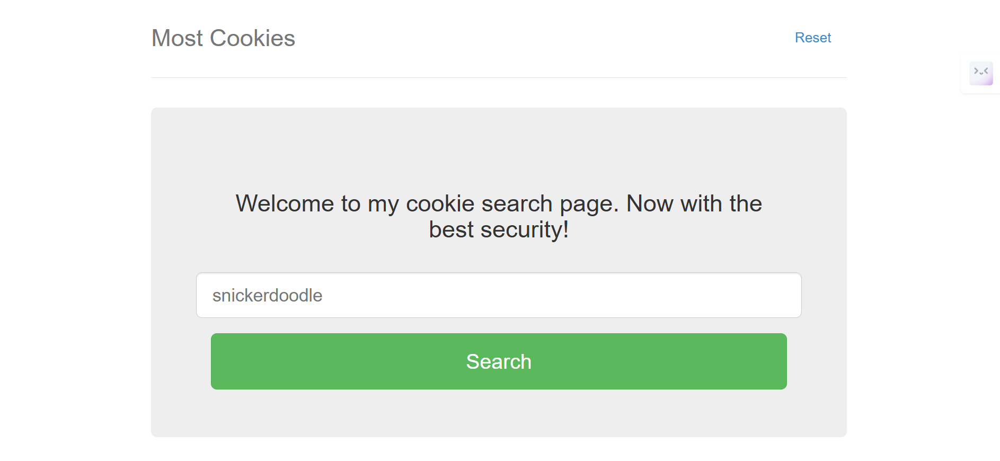

Most Cookies - PicoCTF (Web Exploitation)

## Acknowledgements

This challenge is to specifically solve the challenge "Most Cookies" by MADSTACKS from PicoCTF under Web Exploitation category

## Understanding Flask Cookies
Flask uses signed cookies to maintain session data. A typical Flask cookie consists of three parts, separated by a '.'

eyJ2ZXJ5X2F1dGgiOiJhZG1pbiJ9.Z6WkCQ.64p_wMAYBIzxHrpPTRXML_niZhw

Breakdown:

eyJ2ZXJ5X2F1dGgiOiJhZG1pbiJ9 → Base64 encoded JSON (decoded: {"very_auth":"blank"})

Z6WkCQ → Timestamp (prevents replay attacks)

64p_wMAYBIzxHrpPTRXML_niZhw → Cryptographic hash (ensures integrity)

The security of Flask cookies relies on a secret key, which is used to sign cookies.
## Challenge Breakdown
We are given the source code (server.py) with the following key insights:

app.secret_key = random.choice(cookie_names)

cookie_names = [list of cookie names]

/display endpoint reveals the flag if:

very_auth = admin

The cookie is correctly signed

The timestamp is valid

/reset endpoint resets the session by randomly selecting a new secret key

If /reset is not called, the secret key remains unchanged, which allows for brute-forcing.
## Exploitation Steps
Step 1: Retrieve the Cookie

Use the Cookie Editor Chrome extension to extract the current session cookie.

Step 2: Brute-force the Secret Key

Use flask-unsign to determine the secret key:

flask-unsign --unsign --cookie "YOUR_COOKIE_HERE" --wordlist your_wordlist.txt

The wordlist should contain the cookie names from server.py.

Once successful, this reveals the secret key.
## Forge a Valid Admin Cookie
Now, create a new cookie with {"very_auth":"admin"} and sign it using the retrieved secret key.

Step 4: Send the Forged Cookie & Retrieve the Flag

Since Flask automatically handles the timestamp:

Create a Flask session with the retrieved secret key.

Generate a properly signed cookie.

Send it to the /display endpoint.

Extract the flag from the response.
## Summary
✅ Extract the existing cookie. ✅ Brute-force the secret key using flask-unsign. ✅ Forge a cookie with {"very_auth":"admin"}. ✅ Sign it with the recovered secret key. ✅ Send it to /display and retrieve the flag.

This method is efficient because:

Flask signs cookies automatically.

The /reset endpoint can be avoided to maintain a consistent secret key.

Automating this process with Python ensures speed and accuracy.

Happy Hacking! 🚀
